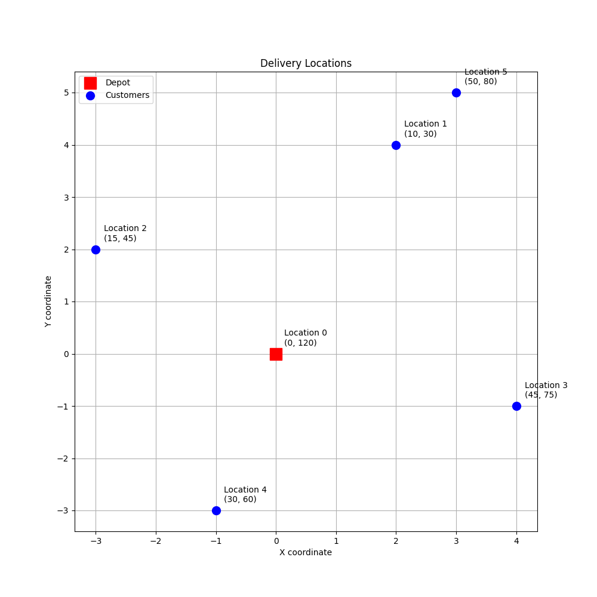
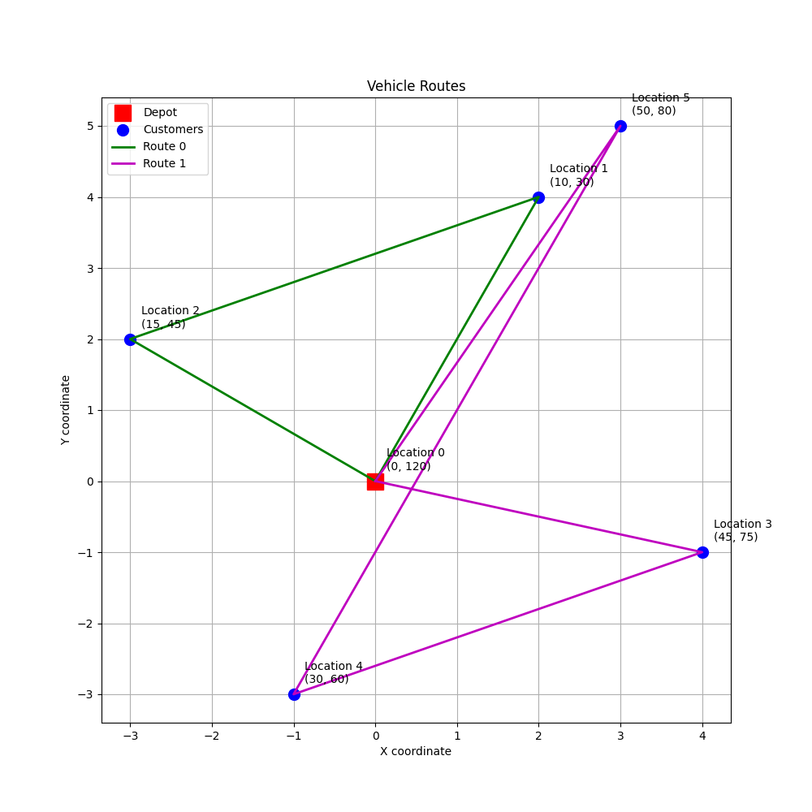

# Vehicle Routing Problem with Time Windows Example

This project demonstrates how to solve a Vehicle Routing Problem (VRP) with Time Windows using Google OR-Tools. The example simulates a delivery service with multiple vehicles that need to visit customers within specific time windows.

## Problem Description

- Multiple vehicles start from a depot
- Each customer has a specific time window for delivery
- Each delivery takes a fixed amount of time (service time)
- Vehicles travel at a constant speed
- The goal is to find routes that satisfy all time windows while minimizing total time

## Features

- Multiple vehicles
- Time window constraints
- Service time at each stop
- Distance-based travel time
- Route optimization to minimize total time
- Visual representation of routes and solutions

## Requirements

```
ortools>=9.6.2534
matplotlib>=3.10.1
numpy>=1.13.3
```

## Installation

1. Create a virtual environment (recommended):
```bash
python -m venv venv
source venv/bin/activate  # On Windows: venv\Scripts\activate
```

2. Install dependencies:
```bash
pip install -r requirements.txt
```

## Usage

Run the example:
```bash
python vrp_with_time_windows.py
```

## Output

The program generates both textual and visual output:

### Text Output
- Routes for each vehicle
- Arrival times at each location
- Time windows for each location
- Total time for each route
- Total time for all routes

### Visual Output
The program generates two visualization files:

1. `initial_locations.png`: Shows the initial problem setup
   - Red square: Depot location
   - Blue dots: Customer locations
   - Labels: Location numbers and time windows
   - Grid: Helps visualize distances

2. `solution_routes.png`: Shows the optimized solution
   - Same locations as initial setup
   - Green line: Route for Vehicle 0
   - Magenta line: Route for Vehicle 1
   - Shows how customers are divided between vehicles
   - Demonstrates the optimal path for each vehicle

Example visualizations:


*Initial problem setup showing depot and customer locations with time windows*


*Optimized solution showing routes for each vehicle*

## Understanding the Code

The code demonstrates several key concepts:
1. Problem modeling with OR-Tools
   - Setting up the routing index manager
   - Creating the routing model
   - Defining constraints and callbacks

2. Time window constraints
   - Each location has a specific time window
   - Vehicles must arrive within these windows
   - Service time at each location is considered

3. Distance calculations
   - Uses Manhattan distance between locations
   - Converts distances to travel times
   - Accounts for vehicle speed

4. Route optimization
   - Minimizes total travel time
   - Respects all time window constraints
   - Balances workload between vehicles

5. Solution visualization
   - Clear visual representation of the problem
   - Shows both initial setup and solution
   - Helps understand the optimization results
