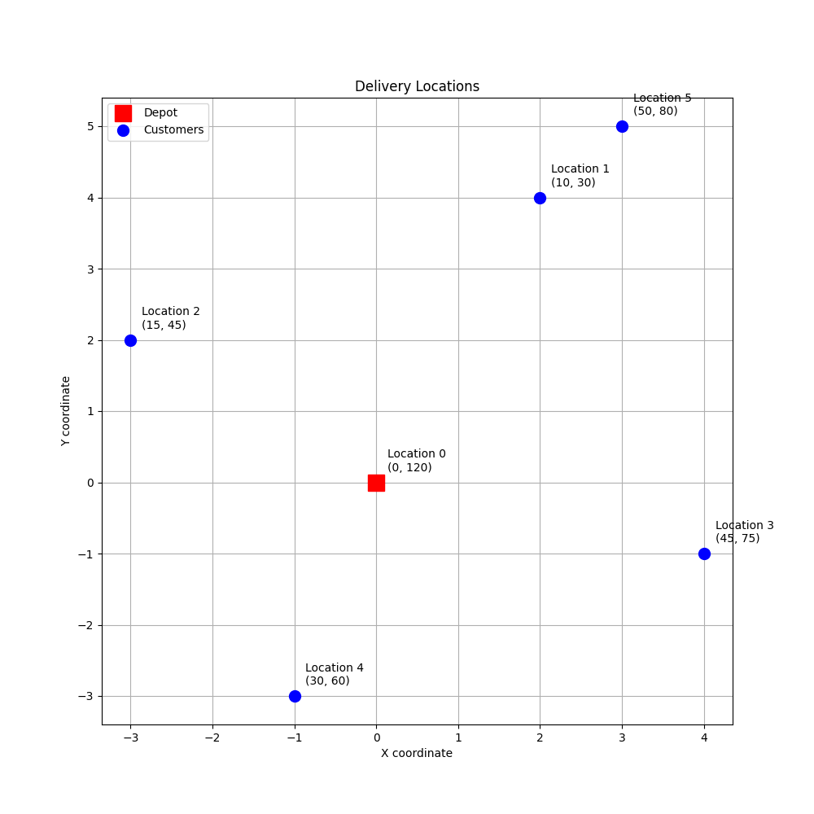
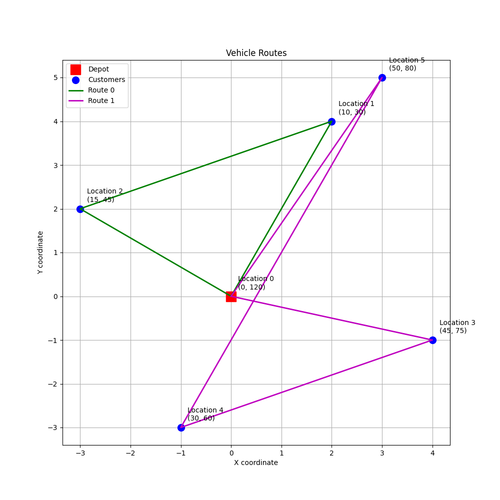
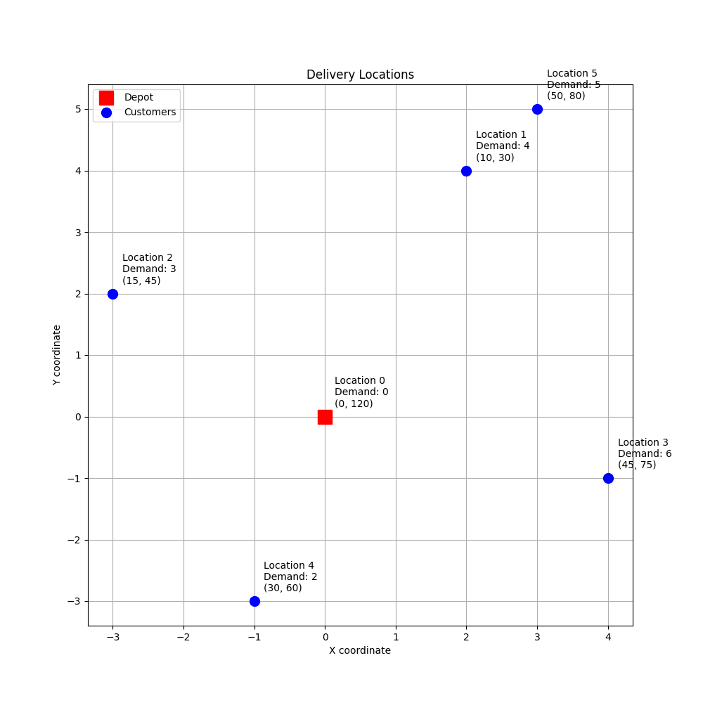
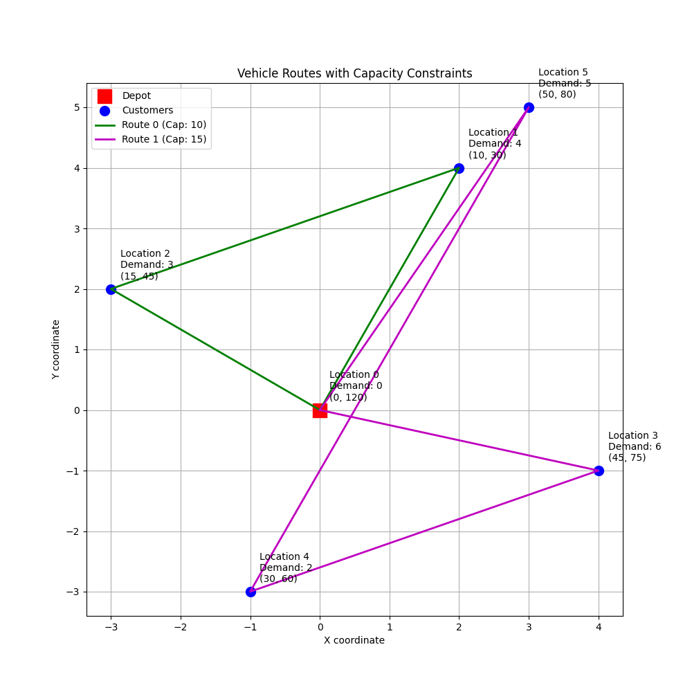
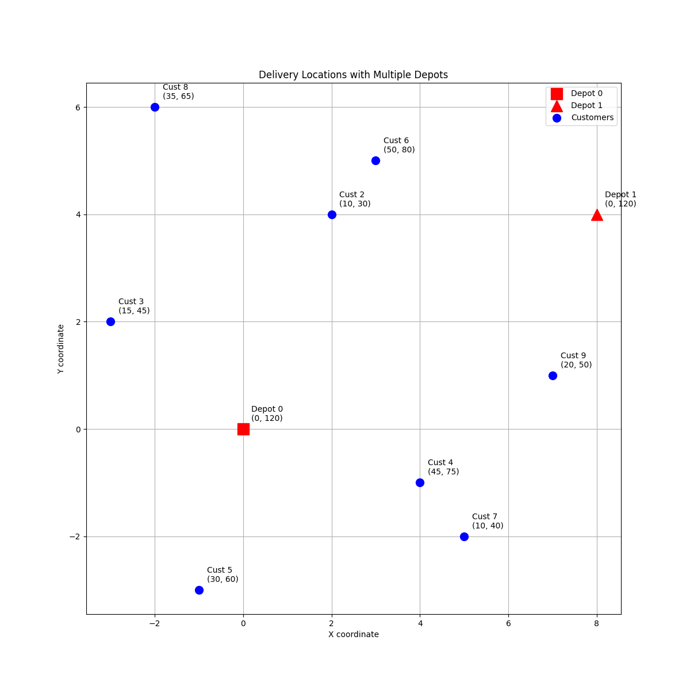
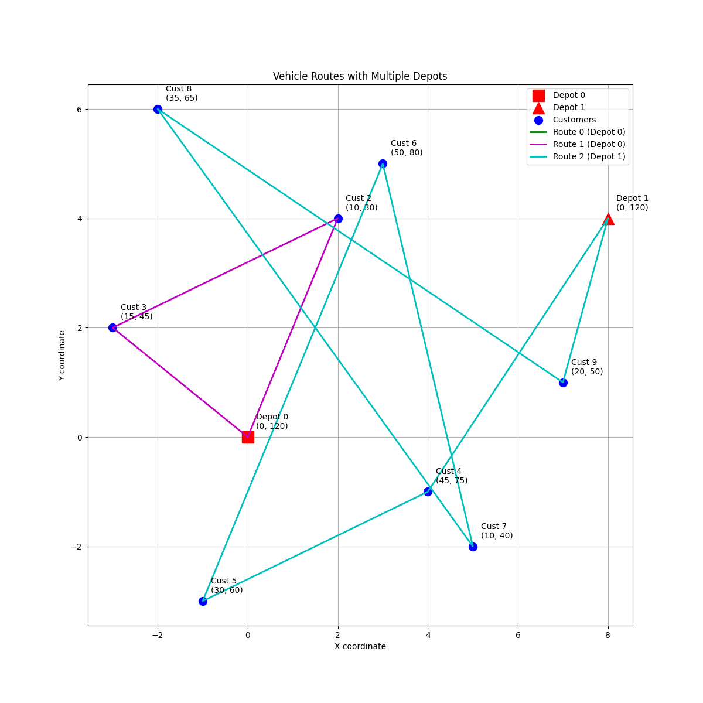

# Vehicle Routing Problem Examples with OR-Tools

This project demonstrates how to solve various Vehicle Routing Problems (VRP) using Google OR-Tools. The examples simulate delivery services with multiple vehicles under different constraints and scenarios.

## Problem Description

The project includes three different VRP scenarios with increasing complexity:

1. **Basic VRP with Time Windows** - Vehicles must visit customers within specific time windows
2. **VRP with Capacity Constraints** - Adds package volume limits to each vehicle
3. **VRP with Multiple Depots** - Vehicles can start from and return to different depot locations

## Features

- Multiple vehicles with customizable properties
- Time window constraints
- Capacity constraints
- Multiple depot support
- Service time at each stop
- Distance-based travel time
- Route optimization to minimize total time
- Visual representation of routes and solutions

## Requirements

```
ortools>=9.6.2534
matplotlib>=3.10.1
numpy>=1.13.3
```

## Installation

1. Create a virtual environment (recommended):
```bash
python -m venv venv
source venv/bin/activate  # On Windows: venv\Scripts\activate
```

2. Install dependencies:
```bash
pip install -r requirements.txt
```

## Usage

Run any of the three examples:
```bash
python 1-vrp_with_time_windows.py
python 2-vrp_with_capacity.py
python 3-vrp_with_multiple_depots.py
```

## Scenario 1: VRP with Time Windows

### Description
Basic VRP where vehicles must visit customers within specific time windows.

### Key Features
- Time window constraints for each customer
- Service time at each location
- Manhattan distance for travel time calculation

### Visual Output

*Initial problem setup with time windows*


*Optimized solution with time windows*

## Scenario 2: VRP with Capacity Constraints

### Description
Extends the time window model by adding capacity constraints to model package volumes.

### Key Features
- All time window constraints from Scenario 1
- Customer demands (package volumes)
- Vehicle capacity limits
- Load tracking throughout routes

### Added Data
```python
# Customer demands
data['demands'] = [0, 4, 3, 6, 2, 5]  # depot has 0 demand

# Vehicle capacities
data['vehicle_capacities'] = [10, 15]  # different capacities per vehicle
```

### Visual Output

*Initial problem setup with demands and capacities*


*Optimized solution respecting both time windows and capacities*

## Scenario 3: VRP with Multiple Depots

### Description
Enhanced VRP model that supports multiple depot locations with vehicles assigned to specific depots.

### Key Features
- Multiple depot locations
- Custom vehicle start/end depot assignments
- Enhanced visualization with depot markers
- Support for 8 customer locations

### Added Data
```python
# Define multiple depots
data['depots'] = [0, 1]  # Locations 0 and 1 are depots

# Assign vehicles to specific depots
data['starts'] = [0, 0, 1]  # Vehicles 0,1 start at depot 0, Vehicle 2 at depot 1
data['ends'] = [0, 0, 1]    # Vehicles return to their starting depots
```

### Visual Output

*Initial problem setup with multiple depots*


*Optimized solution with vehicles returning to their assigned depots*

## Understanding the Code

All three scenarios demonstrate several key OR-Tools concepts:

1. **Problem Modeling**
   - Setting up the routing index manager
   - Creating the routing model
   - Defining constraints and callbacks

2. **Constraint Handling**
   - Time window constraints
   - Capacity constraints
   - Depot assignments

3. **Distance and Time Calculations**
   - Manhattan distance between locations
   - Travel time based on distance
   - Service time at each location

4. **Solution Optimization**
   - Minimizing total travel time
   - Respecting all constraints
   - Balanced workload between vehicles

5. **Visualization**
   - Clear visual representation of problems
   - Route visualization with different colors
   - Detailed annotation of constraints

## Practical Applications

These VRP models can be applied to various real-world scenarios:

- **Delivery Services** with time and capacity constraints
- **Service Technicians** starting from different locations
- **Medical Supply Delivery** with critical time windows
- **Food Delivery** with temperature/time constraints
- **Logistics Companies** with multiple distribution centers

## Extensions

These models can be further extended with additional constraints:

- Heterogeneous fleet (different vehicle speeds, costs)
- Time-dependent travel times (traffic patterns)
- Pickup and delivery pairs
- Customer priorities or penalties
- Vehicle driver shift constraints
